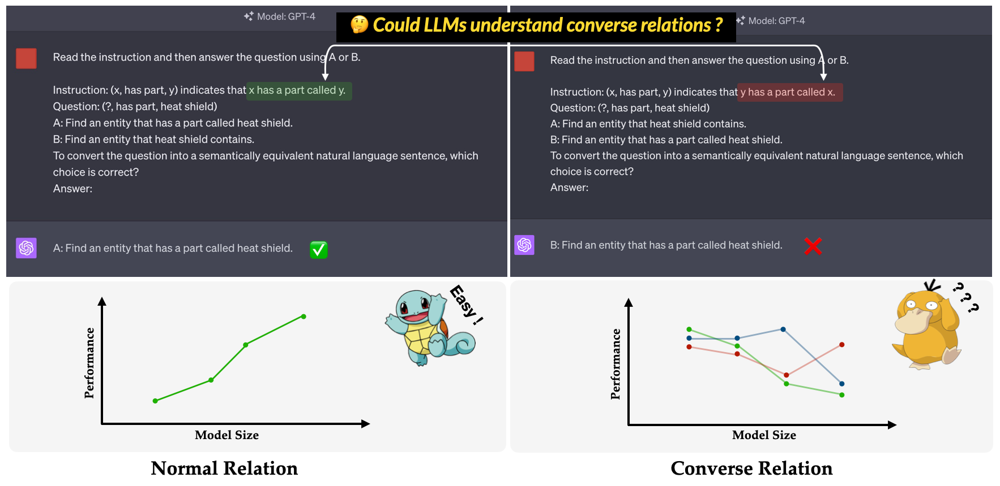

<div align= "center">
    <h1>🤖 ConvRe 🤯</h1>
</div>

<div align="center">


</div>

<p align="center">
  <a href="#Data">🔎 Data</a> &nbsp ｜ &nbsp
  <a href="#Inference with huggingface dataset 🍑">🔨 Code</a> &nbsp ｜ &nbsp
  <a href="#web-ui">🤗 Huggingface Leaderboard</a> &nbsp ｜ &nbsp
  <a href="assets/paper.pdf">📑 Paper</a> &nbsp ｜ &nbsp
  <a href="#citation">♣️ Citation</a>

</p>



🤖**ConvRe**🤯 is the benchmark proposed in our EMNLP 2023 paper: [An Investigation of LLMs’ Inefficacy in Understanding **Conv**erse **Re**lations]().
It aims to evaluate LLMs' ability on understanding converse relations.
Converse relation is defined as the opposite of semantic relation while keeping the surface form of the triple unchanged.
For example, the triple `(x, has part, y)` is interpreted as "x has a part called y" in normal relation, while "y has a part called x" in converse relation 🔁.

The experiments in our paper suggested that LLMs often resort to shortcut learning (or superficial correlations) and still face challenges on our 🤖ConvRe🤯 benchmark even for powerful models like GPT-4.

*Read this in [中文](README_ZH.md).*

## 🍇 What's New

- **[2023/10/08]** **ConvRe** benchmark is released🌟.

## 🥝 Data

ConvRe benchmark is composed of 17 relations and 1240 triples from five widely used knowledge graph datasets: [WN18RR](https://arxiv.org/abs/1707.01476), [FB15K-237](https://aclanthology.org/W15-4007/), [NELL-ONE](https://arxiv.org/abs/1808.09040), [Wikidata5M](https://arxiv.org/abs/1911.06136), [ICEWS14](https://arxiv.org/abs/1809.03202), [ConceptNet5](https://arxiv.org/abs/1612.03975).
The detailed number of triples for each relation in the benchmark is listed below.

|                    Relation                    | # Triples |        Source        |
| :--------------------------------------------: | :-------: | :-------------------: |
|                    hypernym                    |    80    |        WN18RR        |
|                    has part                    |    78    |        WN18RR        |
| organization, organization relationship, child |    75    |       FB15K-237       |
|     location, location, partially contains     |    77    |       FB15K-237       |
|              athlete beat athlete              |    80    |       NELL-ONE       |
|                   parent of                   |    145    | NELL-ONE & Wikidata5M |
|                 represented by                 |    79    |      Wikidata5M      |
|                  side effect                  |     8     |      Wikidata5M      |
|                  has facility                  |    62    |      Wikidata5M      |
|                 influenced by                 |    65    |      Wikidata5M      |
|                    owned by                    |    51    |      Wikidata5M      |
|                    consult                    |    73    |        ICEWS14        |
|               praise or endorse               |    78    |        ICEWS14        |
|                    made of                    |    80    |      ConceptNet5      |
|                    used of                    |    79    |      ConceptNet5      |
|                  has property                  |    55    |      ConceptNet5      |
|                  has subevent                  |    75    |      ConceptNet5      |
|                     Total                     |   1240   |                      |

The dataset files can be found in `Datasets` directory. Here is the description of each file.

- `re2text_prompt.json`: The normal and converse relation definition and corresponding choices of each relation for `re2text` task.
- `re2text_examples.json`: The few shot examples of `re2text` task, including `normal` prompt setting and `hint+cot` setting.
- `text2re_prompt`: The normal and converse relation definition and corresponding choices of each relation for `text2re` task.
- `text2re_examples.json`: The few shot examples of `re2text` task, including `normal` prompt setting and `hint+cot` setting.
- `triple_dataset`: Full dataset of the benchmark, including triples and correct answers.
- `triple_subset`: The subset we used in our paper, it contains 328 triples and their corresponding correct answers.

## 🍒 Supported Models

The models listed below are tested and can be run directly using the script in Inference.

**GPT TEXT MODELS**

- [X] text-ada-001
- [X] text-babbage-001
- [X] text-curie-001
- [X] text-davinci-003
- [X] gpt-3.5-turbo
- [X] gpt-3.5-turbo-0301
- [X] gpt-4
- [X] gpt-4-0314

**Claude MODELS**

- [X] claude-1.3
- [X] claude-instant-1.1

**FLAN-T5 MODELS**

- [X] flan-t5-small
- [X] flan-t5-base
- [X] flan-t5-large
- [X] flan-t5-xl
- [X] flan-t5-xxl

**LLAMA2 CHAT MODELS**

- [X] llama-2-7b-chat-hf
- [ ] llama-2-13b-chat-hf
- [ ] llama-2-70b-chat-hf

**QWEN CHAT MODELS**

- [X] qwen-7b-chat
- [ ] qwen-14b-chat

**INTERNLM MODELS**

- [X] internlm-chat-7b
- [ ] internlm-chat-20b

## 🍑 Inference with huggingface dataset

Our benchmark is available on Huggingface 🤗 ([link](LINK)). You can easily run the inference by using `main_hf.py` and specifying the following three arguments.

- `model_name`: the name of the large language model, see our [supported model list](#supported-models).
- `task`: the subtask of ConvRe benchmark: `text2re` or `re2text`.
- `setting`: prompt setting for current run (prompt1-prompt 12), please refer to our paper(LINK) for more details of each setting.

**Example**

Here is the script to run `prompt4` of `re2text` task on `text-davinci-003` 👇

```bash
python3 main_hf.py --model_name text-davinci-003 --task re2text --setting prompt4
```

## 🍉 Inference in a more flexible way

We also provide a more flexible way to run the experiments. There are ️eight arguments you need to specify.

- `model_name`: the name of the large language model you want to use, see our [supported model list](#supported-models).
- `task`: the subtask of ConvRe benchmark: `text2re` or `re2text`.
- `data_dir`: The directory where the dataset stored.
- `prompt`: The type of prompt to use in the experiment: `normal`, `hint` or `hint+cot`.
- `relation`: The relation type to use in the experiment: `normal` for normal relation and `converse` for converse relation.
- `n_shot`: Few-shot numbers, choose a number in [0, 1, 2, 3, 4, 5, 6].
- `example_type`: The type of few-shot examples, `hard` or `regular`.
- `text_type`: The type of text to use in the experiment, `regular` or `hard`.

The argument settings for each of the 12 prompt used in our paper is listed below.

| Prompt ID |  prompt  | relation | n_shot | example_type | text_type |
| :--------: | :------: | :------: | :----: | :----------: | :-------: |
| re2text 1# |  normal  |  normal  |   0   |   regular   |  regular  |
| text2re 1# |  normal  |  normal  |   0   |   regular   |   hard   |
| re2text 2# |  normal  |  normal  |   0   |   regular   |   hard   |
| text2re 2# |  normal  |  normal  |   0   |   regular   |  regular  |
| re2text 3# |  normal  | converse |   0   |   regular   |  regular  |
| text2re 3# |  normal  | converse |   0   |   regular   |   hard   |
| re2text 4# |  normal  | converse |   0   |   regular   |   hard   |
| text2re 4# |  normal  | converse |   0   |   regular   |  regular  |
| re2text 5# |   hint   | converse |   0   |   regular   |  regular  |
| text2re 5# |   hint   | converse |   0   |   regular   |   hard   |
| re2text 6# |   hint   | converse |   0   |   regular   |   hard   |
| text2re 6# |   hint   | converse |   0   |   regular   |  regular  |
|     7#     |  normal  | converse |   3   |     hard     |   hard   |
|     8#     | hint+cot | converse |   3   |     hard     |   hard   |
|     9#     |  normal  | converse |   6   |     hard     |   hard   |
|    10#    |  normal  | converse |   3   |   regular   |   hard   |
|    11#    | hint+cot | converse |   3   |   regular   |   hard   |
|    12#    |  normal  | converse |   6   |   regular   |   hard   |

**Example**

Here is the script to run `prompt3` of `text2re` task on `gpt-3.5-turbo-0301` 👇

```bash
python3 main.py --model_name gpt-3.5-turbo-0301 --task text2re --data_dir data --prompt normal --relation converse --n_shot 0 --example_type regular --text_type hard
```

## 🍈 Evaluation

There are three arguments need to be specified when running the evaluation script.

- `file_path`: The `path` of the result file 📁.
- `model_family`: The model family of the result file, used to choose the corresponding evaluator. You should choose from `flan-t5`, `claude`, `gpt-text`, `gpt-chat`, `llama2`, `qwen`, `internlm`.
- `mode`: We provide two evaluation mode: `strict` and `auto`. `strict` mode will raise errors if the answer of the model isn't consistent with what we want. In this case, you should check the model's answer manually.
  `auto` mode will just ignore the inconsistent answers. The performance calculated under `auto` mode may be lower than `strict` mode, but it's very convenient and doesn't need any human support. **💡The ability to align with user's request is also a very important indicator of LLMs' capability.**

## 🍓 Citation
